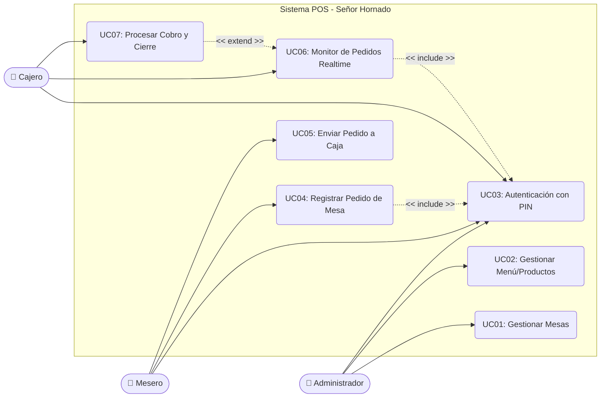

# Evidencia GA2-220501093-AA1-EV02
## Elaboración de diagramas y plantillas para casos de uso del proyecto

**Proyecto:** Sistema de Punto de Venta (POS) "Señor Hornado"
**Fase:** Análisis y Diseño
**Metodología:** UML / Historias de Usuario

---

## 1. Identificación y Análisis Previo

Basándonos en el informe de requerimientos previamente levantado y estructurado para el POS "Señor Hornado", se ha determinado la necesidad de modelar el sistema utilizando **Diagramas de Casos de Uso** bajo los estándares del Lenguaje Unificado de Modelado (UML).

Este enfoque nos permitirá:
- Identificar los actores del sistema (perfiles de usuario).
- Representar gráficamente las interacciones entre los actores y los procesos del software.
- Documentar formalmente el flujo de cada requerimiento mediante plantillas extendidas e historias de usuario, garantizando la trazabilidad.

### Actores Identificados:
1. **Administrador:** Encargado de gestionar el negocio, el menú, las mesas y el personal.
2. **Mesero:** Personal de piso que toma los pedidos mediante una interfaz móvil táctil (mobile-first).
3. **Cajero:** Personal encargado de recibir pedidos consolidados en tiempo real y procesar facturación/pagos.

---

## 2. Modelado Técnico: Diagrama de Casos de Uso

El siguiente diagrama UML (representado en formato estructurado) muestra los límites del sistema y la relación de los procesos funcionales de la aplicación "Señor Hornado" con cada actor.

*(Nota: En la notación estándar UML, los actores se representan con figuras de palito "stickman" y los casos de uso como elipses, rodeados por un marco que define el límite del sistema. El diagrama de arriba plasma esta estructura bajo el estándar Mermaid).*

---

## 3. Documentación: Plantillas de Casos de Uso

A continuación, se documentan con el formato de plantillas extendidas los casos de uso más críticos por cada actor del sistema, para garantizar su trazabilidad y correcto desarrollo en código.

### Plantilla CU-04: Registrar Pedido de Mesa
| Campo | Descripción |
| :--- | :--- |
| **Identificador** | UC-04 |
| **Nombre del Caso de Uso** | Registrar Pedido de Mesa (Toma de Orden) |
| **Actor Principal** | Mesero |
| **Descripción** | Permite al mesero seleccionar una mesa activa, visualizar el catálogo de platos por categorías e ir agregando productos a la cuenta de la mesa actual desde un dispositivo móvil. |
| **Precondiciones** | El mesero debe haber ingresado al sistema con su PIN (UC-03). La mesa debe estar configurada en el sistema (UC-01). |
| **Flujo Principal** | 1. El mesero ingresa a la vista principal de la App. 2. El sistema muestra la lista de mesas disponibles/ocupadas. 3. El mesero selecciona una mesa. 4. El sistema despliega el menú categorizado (Hornado, Carnes, Bebidas). 5. El mesero toca los productos deseados para añadirlos al carrito del pedido. 6. El mesero revisa el resumen de la orden. 7. El mesero confirma la orden. |
| **Flujos Alternativos** | **5a. Producto sin stock:** Si un producto está agotado, el sistema lo muestra deshabilitado o no permite añadirlo, notificando "Agotado". **5b. Notas adicionales:** El mesero puede agregar un comentario al plato (Ej. "Sin cebolla"). |
| **Postcondiciones** | El pedido queda registrado localmente o en el estado de la aplicación asociado a esa mesa, listo para ser enviado a caja. |

### Plantilla CU-07: Procesar Cobro y Cierre
| Campo | Descripción |
| :--- | :--- |
| **Identificador** | UC-07 |
| **Nombre del Caso de Uso** | Procesar Cobro de Mesa y Cierre |
| **Actor Principal** | Cajero |
| **Descripción** | Permite al cajero liquidar la cuenta de una mesa cuyo pedido ha finalizado, calculando los totales, aplicando propina, registrando el medio de pago y liberando la mesa. |
| **Precondiciones** | El cajero debe estar autenticado. Debe existir un pedido en estado "en_caja" proveniente de un mesero. |
| **Flujo Principal** | 1. El cajero selecciona una cuenta pendiente desde su Monitor (UC-06). 2. El sistema desglosa los productos consumidos y calcula el subtotal y total. 3. El cajero indica si el cliente deja propina voluntaria, y el sistema recalcula. 4. El cajero selecciona el método de pago (Efectivo, Tarjeta, Transferencia). 5. El cajero confirma el pago. 6. El sistema marca el pedido como "cerrado" y cambia el estado de la mesa a "libre". |
| **Flujos Alternativos** | **4a. Pago mixto:** El cliente paga una parte en efectivo y otra con tarjeta. El sistema permite registrar ambos valores. **5a. Error de pago:** Si la transacción de tarjeta falla, el cajero puede cancelar el cierre y mantener la cuenta abierta. |
| **Postcondiciones** | La mesa queda libre para una nueva atención. Los valores ingresan a las ventas del día para el Dashboard del Administrador. |

### Plantilla CU-01: Gestionar Mesas
| Campo | Descripción |
| :--- | :--- |
| **Identificador** | UC-01 |
| **Nombre del Caso de Uso** | Gestionar Mesas (CRUD) |
| **Actor Principal** | Administrador |
| **Descripción** | Permite al administrador crear nuevas mesas, editar sus números o eliminarlas del salón para reflejar la distribución física del restaurante. |
| **Precondiciones** | El administrador debe haber iniciado sesión en el Panel de Administración. |
| **Flujo Principal** | 1. El administrador ingresa a la sección "Gestión de Mesas". 2. El sistema muestra la lista actual de mesas. 3. El administrador selecciona "Agregar Mesa". 4. El administrador ingresa el identificador de la mesa (Ej. "Mesa 10") y guarda. 5. El sistema registra la nueva mesa en Firestore y actualiza la lista. |
| **Flujos Alternativos** | **3a. Eliminar Mesa:** El administrador selecciona una mesa y presiona eliminar.  **3b. Mesa ocupada (Restricción):** Si la mesa que intenta eliminar tiene una cuenta abierta, el sistema arroja error y no permite su eliminación (Seguridad). |
| **Postcondiciones** | El mapeo de mesas del restaurante queda actualizado y los meseros verán los cambios inmediatamente en su interfaz. |

---

## 4. Historias de Usuario

A la par de las plantillas de casos de uso técnicas, se han desarrollado las siguientes historias de usuario (bajo formato Ágil) para nutrir el Product Backlog en la herramienta de seguimiento (Monday.com).

### Historia de Usuario 1: Registro Rápido de Pedidos
- **Como** mesero del restaurante...
- **Quiero** poder agregar platos a la cuenta de una mesa con solo tocar la pantalla de mi celular (sin usar zoom doble tap)...
- **Para** tomar los pedidos de los clientes de forma mucho más rápida y no hacerlos esperar.
- **Criterios de Aceptación:**
  - La interfaz debe estar diseñada bajo el paradigma mobile-first.
  - Los botones de los productos deben tener un área táctil amplia.
  - Al tocar dos veces rápido un botón, no se debe hacer zoom en la interfaz del navegador.
  - Debe poder agregar notas descriptivas a los platos.

### Historia de Usuario 2: Sincronización Inmediata en Caja
- **Como** cajero del turno...
- **Quiero** visualizar en mi pantalla de manera automática y sin recargar la página cuando un mesero envía un pedido finalizado...
- **Para** poder tener la cuenta lista apenas el cliente se acerque a pagar y reducir los cuellos de botella en la salida.
- **Criterios de Aceptación:**
  - La interfaz de caja debe usar un listener en tiempo real (Firestore Realtime).
  - Al recibir una nueva orden en estado "en_caja", debe aparecer una alerta visual o notificación en el dashboard.
  - El tiempo desde que el mesero presiona "Enviar" hasta que el cajero lo ve no debe superar los 3 segundos.

### Historia de Usuario 3: Protección de Cuentas Abiertas
- **Como** administrador del sistema...
- **Quiero** que el sistema bloquee la opción de eliminar una mesa si esta se encuentra ocupada por clientes actualmente...
- **Para** evitar pérdidas de información financiera y descuadres en caja por errores de borrado accidental.
- **Criterios de Aceptación:**
  - Antes de efectuar una eliminación en la base de datos (Colección: `tables`), el sistema verificará el campo `estado`.
  - Si el `estado` es "ocupada" o "pagando", el botón de eliminar debe estar deshabilitado o lanzar un modal de error restrictivo.
