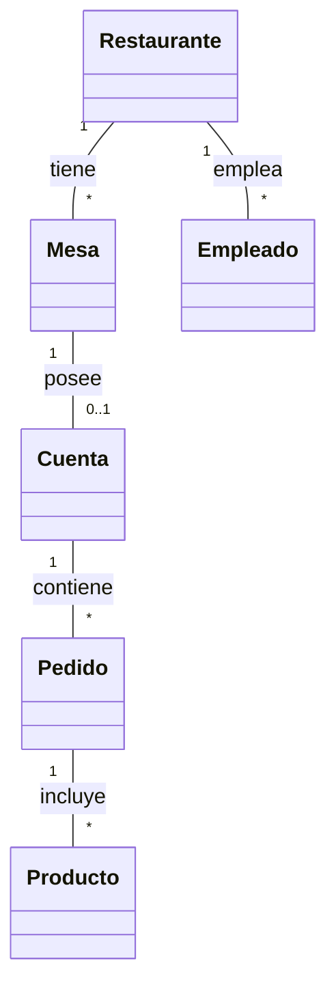
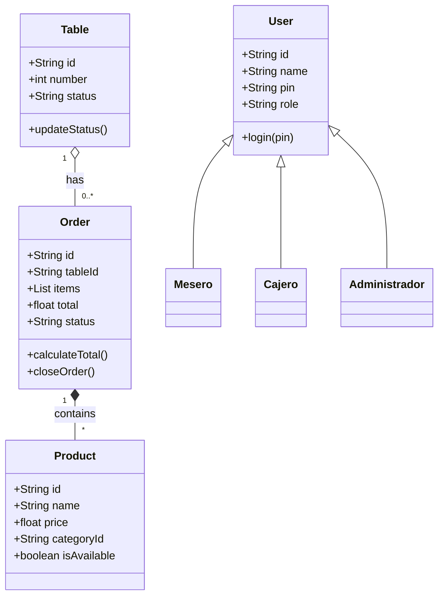
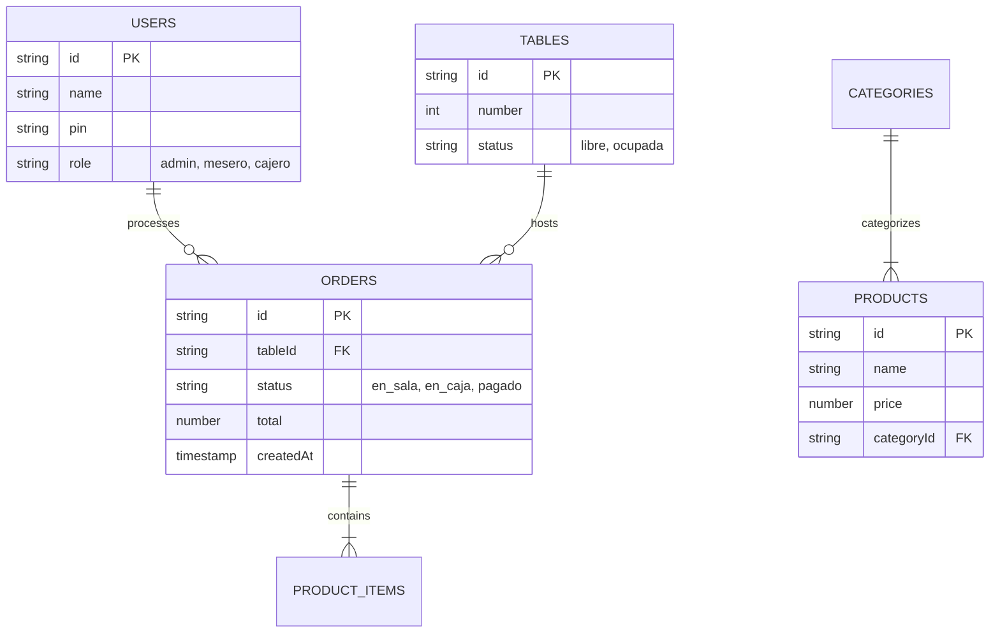
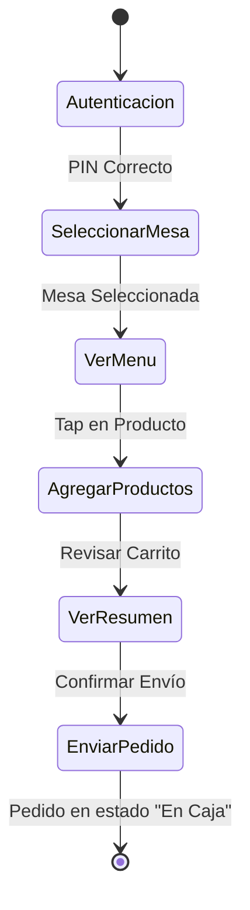
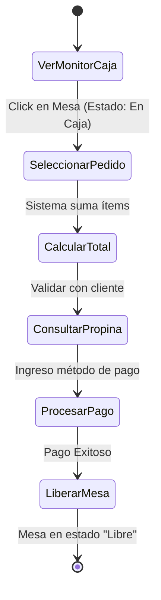

# Evidencia GA2-220501093-AA1-EV04
## Diagramas y documentación de actividades del proyecto

---

## FICHA DEL DOCUMENTO
| Fecha | Revisión | Autor | Verificado por |
| :--- | :--- | :--- | :--- |
| [Fecha Actual] | 1.0 | [Nombre del Aprendiz] | Instructor SENA |

**Documento validado por las partes en fecha:** [Fecha Actual]
* **Por el cliente:** D./Dña. [Nombre Cliente/Instructor]
* **Por la empresa suministradora:** D./Dña. [Nombre Aprendiz]

---

## CONTENIDO
1. INTRODUCCIÓN
   1.1 Propósito
   1.2 Alcance
   1.3 Personal involucrado
   1.4 Definiciones, acrónimos y abreviaturas
   1.5 Referencias
   1.6 Resumen
2. DESCRIPCIÓN GENERAL
   2.1 Perspectiva del producto
   2.2 Funcionalidad del producto
   2.3 Características de los usuarios
   2.4 Restricciones
   2.5 Suposiciones y dependencias
   2.6 Evolución previsible del sistema
3. REQUISITOS ESPECÍFICOS
   3.1 Requisitos comunes de los interfaces
       3.1.1 Interfaces de usuario
       3.1.2 Interfaces de hardware
       3.1.3 Interfaces de software
       3.1.4 Interfaces de comunicación
   3.2 Requisitos funcionales
       3.2.1 Requisito funcional 1 (UC-04)
       3.2.2 Requisito funcional 2 (UC-07)
       3.2.3 Requisito funcional 3 (UC-01)
       3.2.4 Requisito funcional 4 (UC-05/06)
   3.3 Requisitos no funcionales
       3.3.1 Requisitos de rendimiento
       3.3.2 Seguridad
       3.3.3 Fiabilidad
       3.3.4 Disponibilidad
       3.3.5 Mantenibilidad
       3.3.6 Portabilidad
   3.4 Otros requisitos
4. APÉNDICES (Modelos del Sistema y UML)

---

## 1 INTRODUCCIÓN

### 1.1 Propósito
El propósito de este documento es consolidar la documentación técnica del Sistema de Punto de Venta (POS) "Señor Hornado", integrando la especificación de requisitos (bajo estándar IEEE 830) con los artefactos de modelado UML y arquitectura de datos requeridos para la fase de Análisis y Diseño. Se establece formalmente el uso de la **Metodología Ágil (Scrum)** apoyada en herramientas de modelado de software.

### 1.2 Alcance
El documento cubre el modelado estructural y de comportamiento del sistema POS "Señor Hornado", incluyendo diagramas de clases, modelo de dominio, modelo entidad-relación (ER) para la base de datos NoSQL y diagramas de actividades que explican los flujos principales (toma de pedidos y cobros). Todo esto soportado sobre los requisitos ya definidos.

### 1.3 Personal involucrado
| Nombre | Rol | Categoría profesional | Responsabilidades |
| :--- | :--- | :--- | :--- |
| [Tu Nombre] | Analista de Software | Aprendiz SENA | Modelado UML, diseño de arquitectura de BD y análisis de requisitos. |
| [Nombre Instructor] | Revisor | Instructor | Evaluación de artefactos y validación de estándares. |

### 1.4 Definiciones, acrónimos y abreviaturas
* **UML:** Unified Modeling Language (Lenguaje Unificado de Modelado).
* **ER:** Entity-Relationship (Entidad-Relación).
* **Scrum:** Marco de trabajo ágil para el desarrollo de software.
* **Firestore:** Base de datos documental (NoSQL) provista por Firebase.

### 1.5 Referencias
* **IEEE Std 830-1998:** Práctica recomendada para especificación de requisitos.
* **Evidencia GA2-220501093-AA1-EV03:** Elaboración de historias de usuario.
* **Componente Formativo SENA:** "Gestión de requisitos" y "Modelado de software".

### 1.6 Resumen
Las secciones 2 y 3 mantienen la definición estricta del producto y sus requisitos funcionales/no funcionales. La sección 4 (Apéndices) contiene el núcleo de esta evidencia: la consolidación gráfica e interpretativa de las funciones del software mediante diagramas UML (Clases, Actividades), el modelo del dominio y el diseño de la base de datos (Modelo ER), validando así el análisis técnico del proyecto.

---

## 2 DESCRIPCIÓN GENERAL

### 2.1 Perspectiva del producto
El sistema se desarrollará bajo una **metodología de desarrollo Ágil**, específicamente Scrum, lo cual permite iteraciones rápidas (sprints) y adaptación a cambios. El modelado UML presente en este documento sirve como puente entre los requerimientos ágiles (Historias de Usuario) y la implementación técnica en código, asegurando que la arquitectura soporte el flujo de trabajo del restaurante en tiempo real.

### 2.2 Funcionalidad del producto
* Gestión de Entorno (Mesas, Menú, Categorías).
* Toma de Pedidos (Interfaz Mobile-first para meseros).
* Monitor de Caja (Sincronización de pedidos en tiempo real).
* Procesamiento de Pago y Cierre de Órdenes.

### 2.3 Características de los usuarios
* **Administrador:** Gestiona la estructura base del negocio (CRUD de mesas y productos).
* **Mesero:** Interactúa con el diagrama de actividades de "Toma de Pedido" desde un dispositivo móvil.
* **Cajero:** Interactúa con el diagrama de actividades de "Procesar Cobro" desde un terminal de caja.

### 2.4 Restricciones
* El modelado de base de datos debe adaptarse a un paradigma NoSQL (documental) por el uso de Firestore.
* El diseño de la UI debe garantizar fluidez extrema sin recargas de página (Single Page Application).

### 2.5 Suposiciones y dependencias
* Se asume conocimiento de programación orientada a objetos para interpretar el diagrama de clases.
* Dependencia de conexión a internet para el flujo de actividades en tiempo real.

### 2.6 Evolución previsible del sistema
* Inclusión de nuevas entidades al modelo ER (Ej. Clientes frecuentes, Inventario de insumos).

---

## 3 REQUISITOS ESPECÍFICOS

### 3.1 Requisitos comunes de los interfaces
#### 3.1.1 Interfaces de usuario
* Vistas separadas por rol (Administrador, Mesero, Cajero).
#### 3.1.2 Interfaces de hardware
* Uso de pantallas táctiles capacitivas para los meseros.
#### 3.1.3 Interfaces de software
* Framework Angular y base de datos Firestore (Firebase).
#### 3.1.4 Interfaces de comunicación
* WebSockets para la escucha pasiva de cambios en los documentos (onSnapshot).

### 3.2 Requisitos funcionales

#### 3.2.1 Requisito funcional 1 (UC-04: Registrar Pedido de Mesa)
* El sistema permitirá al "Mesero" registrar un pedido. *(Ver Diagrama de Actividades 1 en Apéndices).*

#### 3.2.2 Requisito funcional 2 (UC-07: Procesar Cobro y Cierre)
* El sistema permitirá al "Cajero" liquidar una cuenta. *(Ver Diagrama de Actividades 2 en Apéndices).*

#### 3.2.3 Requisito funcional 3 (UC-01: Gestionar Mesas)
* El sistema permitirá al "Administrador" realizar CRUD sobre la entidad *Table*.

#### 3.2.4 Requisito funcional 4 (UC-05/06: Sincronización en Caja)
* Actualización inmediata del estado visual de la aplicación tras insertar datos en Firestore.

### 3.3 Requisitos no funcionales
*(Consolidados)*
#### 3.3.1 Requisitos de rendimiento: Sincronización < 3 segundos.
#### 3.3.2 Seguridad: Acceso por PIN cifrado.
#### 3.3.3 Fiabilidad: Resistencia a cortes locales de internet (Offline persistence).
#### 3.3.4 Disponibilidad: 99.9% Uptime en la nube.
#### 3.3.5 Mantenibilidad: Diseño orientado a componentes (Angular).
#### 3.3.6 Portabilidad: Soporte multiplataforma web (PWA).

### 3.4 Otros requisitos
* Cumplimiento del modelado UML según estándares de la industria del software.

---

## 4 APÉNDICES (Modelos del Sistema y UML)

En esta sección se adjuntan los modelos gráficos que representan la solución de software, cumpliendo con los lineamientos técnicos de la evidencia EV04. *(Los diagramas están representados en sintaxis Mermaid para su renderizado técnico).*

### 4.1 Modelo del Dominio
Representa conceptualmente cómo entiende el negocio sus propios procesos y entidades, independiente de la tecnología.

### 4.2 Diagrama de Clases
Describe la estructura estática del sistema orientado a objetos, identificando clases, atributos y métodos fundamentales.

### 4.3 Modelo de Base de Datos (Modelo Entidad-Relación)
Representación de las colecciones y documentos proyectados para Cloud Firestore.

### 4.4 Diagramas de Actividades

#### Actividad 1: Toma de Pedido (Actor: Mesero)
Representa el flujo de pasos desde que el mesero inicia sesión hasta que envía el pedido a cocina/caja.

#### Actividad 2: Procesamiento de Cobro (Actor: Cajero)
Representa el flujo desde que el cajero visualiza el pedido hasta que libera la mesa.

### 4.5 Plantillas de Historias de Usuario (Consolidado)
Como parte del marco Ágil adoptado, se resumen las historias de usuario clave que impulsan los diagramas anteriores.

| ID | Nombre | Descripción | Estimación |
| :--- | :--- | :--- | :--- |
| **HU-01** | Registro Rápido | Como mesero, quiero agregar platos tocando la pantalla sin hacer zoom accidental, para tomar pedidos más rápido. | 5 pts |
| **HU-02** | Monitor Realtime | Como cajero, quiero ver nuevas órdenes sin recargar la página, para cobrar ágilmente a los clientes en fila. | 8 pts |
| **HU-03** | Protección de Mesas | Como administrador, quiero que no se puedan borrar mesas ocupadas, para evitar pérdida de facturación. | 3 pts |
