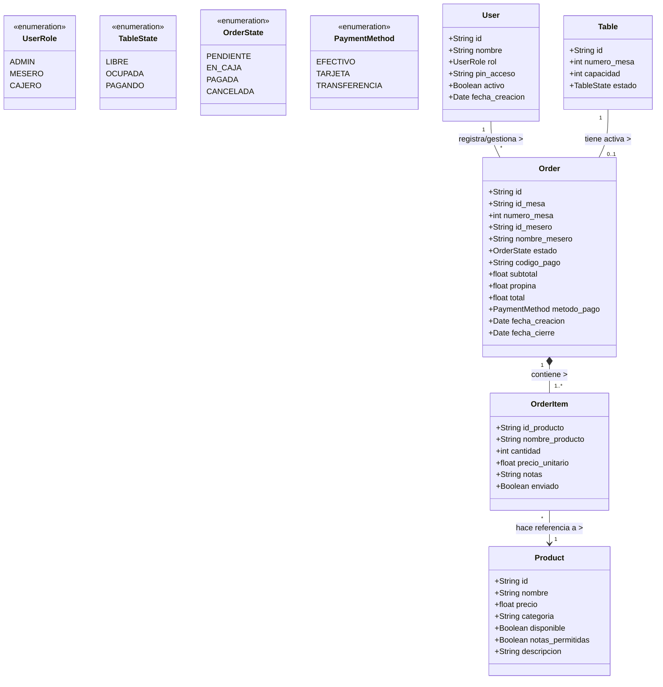

# Evidencia GA2-220501093-AA2-EV01
## Elaboración de los diagramas del modelo de dominio del proyecto

**Proyecto:** Sistema de Punto de Venta (POS) "Señor Hornado"
**Fase:** Análisis y Diseño Orientado a Objetos
**Metodología:** UML (Lenguaje Unificado de Modelado)

---

## 1. Objetivo de la Actividad

El propósito de este documento es representar formalmente el contexto del negocio del restaurante "Señor Hornado" mediante herramientas de modelado técnico. A través de diagramas UML, se identifican las entidades (clases) que intervienen en el sistema, cómo se relacionan entre sí (dependencias, herencia, cardinalidad) y cómo se organizan lógicamente mediante paquetes. 

Este modelo conceptual servirá como base estricta para la implementación de la base de datos en Firestore y las estructuras de datos en el frontend (Angular).

---

## 2. Diagrama de Paquetes (Arquitectura Conceptual)

El diagrama de paquetes permite organizar los componentes del sistema en agrupaciones lógicas, facilitando la comprensión de la arquitectura general y las dependencias entre los distintos módulos del software.

```mermaid
classDiagram
    namespace Core {
        class AuthService
        class OrderService
        class TableService
        class ProductService
    }

    namespace Shared_Models {
        class User
        class Table
        class Product
        class Order
        class OrderItem
    }

    namespace Features {
        class AdminModule
        class WaiterModule
        class CashierModule
    }
    
    Features ..> Core : Utiliza servicios
    Core ..> Shared_Models : Manipula entidades
    Features ..> Shared_Models : Visualiza/Edita
```

### Descripción de los Paquetes:
* **Shared_Models:** Contiene las entidades puras del dominio del negocio (Clases/Interfaces base de datos). Son independientes y fundamentales.
* **Core:** Contiene la lógica de negocio y los servicios de acceso a datos que gestionan el ciclo de vida de las entidades.
* **Features:** Contiene los módulos visuales y de interacción separados por el rol del usuario (Administrador, Mesero, Cajero).

---

## 3. Modelo de Dominio: Diagrama de Clases

El siguiente diagrama UML de clases representa las entidades del negocio, sus atributos, métodos (en el contexto de los servicios que las gestionan) y las relaciones de multiplicidad y dependencia.



### 3.1 Diccionario del Modelo de Dominio

1. **User (Usuario):** Entidad que representa al personal del restaurante. Se categoriza por `UserRole`. Un usuario puede tener múltiples órdenes a su cargo a lo largo del tiempo.
2. **Table (Mesa):** Representa el recurso físico del restaurante. Su estado (`TableState`) determina si el sistema permite asociarle una nueva orden o si está bloqueada por estar en proceso de pago.
3. **Product (Producto):** Constituye el menú. Puede estar no disponible temporalmente sin necesidad de ser borrado del sistema.
4. **Order (Orden/Pedido):** Es la clase central transaccional. Conecta la mesa, el mesero y el detalle de consumo. Almacena la trazabilidad financiera del consumo.
5. **OrderItem (Línea de Pedido):** Entidad débil (Composición) que existe únicamente dentro de una `Order`. Representa la cantidad y personalización (notas) de un `Product` específico dentro de una cuenta.

### 3.2 Análisis de Cardinalidad
* **Mesa - Orden (1 a 0..1):** Una mesa en un momento dado puede tener cero órdenes activas (si está libre) o exactamente una orden activa (si está ocupada).
* **Orden - OrderItem (1 a Muchos):** Una orden está compuesta por uno o varios ítems. Si se destruye la orden, se destruyen sus ítems (relación de composición estricta `*--`).
* **OrderItem - Producto (Muchos a 1):** Múltiples ítems de diferentes órdenes pueden hacer referencia al mismo producto del menú.

---

## 4. Documentación: Plantilla de Casos de Uso del Dominio

Para complementar la visión estática del modelo de dominio, a continuación se presenta la plantilla estándar para documentar uno de los comportamientos dinámicos más importantes que afecta a múltiples clases del dominio simultáneamente (`User`, `Table`, `Order`, `Product`).

### Caso de Uso: UC-04 - Registrar Pedido de Mesa

| Campo | Descripción Técnica |
| :--- | :--- |
| **Identificador** | UC-04 |
| **Nombre** | Registrar Pedido de Mesa (Toma de Orden) |
| **Actor Principal** | Mesero (Instancia de `User` con rol `MESERO`) |
| **Propósito** | Instanciar un objeto `Order` relacionándolo con una `Table` existente, y poblar su lista de `OrderItem` seleccionados a partir de objetos `Product` disponibles. |
| **Precondiciones** | 1. El objeto `User` debe estar autenticado.<br>2. La `Table` objetivo debe tener su atributo `estado = LIBRE` o `OCUPADA` (para agregar más). |
| **Flujo Principal** | 1. El mesero consulta la colección de `Table`.<br>2. El sistema filtra y muestra mesas con estado diferente a `PAGANDO`.<br>3. El mesero selecciona una mesa.<br>4. El mesero consulta los `Product` con `disponible = true`.<br>5. El mesero instancia objetos `OrderItem` y los agrega a la orden en curso local.<br>6. El mesero envía la orden.<br>7. El sistema persiste la `Order` completa en la base de datos.<br>8. El sistema muta el estado de la `Table` a `OCUPADA`. |
| **Postcondiciones** | Una nueva instancia de `Order` ha sido guardada con estado `PENDIENTE` o `EN_CAJA`. La mesa se encuentra ahora indisponible para otros meseros. |
| **Reglas de Negocio** | No se pueden agregar `OrderItem` a una orden si la `Table` asociada ha pasado al estado `PAGANDO`. |
