# Evidencia GA2-220501093-AA3-EV01
## Mapa Conceptual sobre Validación de Documentos

**Estudiante:** 220501093  
**Actividad:** AA3 - EV01  
**Denominación:** Mapa Conceptual sobre Validación de Documentos  
**Proyecto:** Sistema POS y Facturación Electrónica - Restaurante Señor Hornado  
**Fecha de Elaboración:** 2026-06-09

---

## 1. Objetivo de la Actividad

Establecer una **secuencia lógica de dependencias** para llevar a cabo la validación de los documentos identificados en el proceso de desarrollo del proyecto "Sistema POS y Facturación Electrónica para Restaurante Señor Hornado". El presente mapa conceptual estructura el proceso de verificación de los artefactos generados durante la fase de análisis del software, asegurando que todos los documentos cumplan con los estándares de calidad y completitud requeridos.

---

## 2. Mapa Conceptual - Estructura de Validación de Documentos

```
VALIDACIÓN DE DOCUMENTOS - PROYECTO SEÑOR HORNADO
├─ CATEGORÍAS DE DOCUMENTOS
│  ├─ Documentos de Requisitos
│  ├─ Documentos de Análisis
│  ├─ Documentos de Diseño
│  └─ Documentos Técnicos
│
├─ METODOLOGÍA DE DESARROLLO
│  └─ SCRUM / Ciclo Iterativo Adaptativo
│
├─ FASE DE ANÁLISIS (Artifacts)
│  ├─ 1. Análisis de Requisitos
│  │  ├─ Contexto del Proyecto
│  │  ├─ PRD (Product Requirements Document)
│  │  └─ Especificación de Requisitos
│  │
│  ├─ 2. Modelado del Negocio
│  │  ├─ Casos de Uso del Sistema
│  │  ├─ Historias de Usuario
│  │  ├─ Diagrama de Actividades
│  │  └─ Modelo de Dominio
│  │
│  └─ 3. Diseño de Solución
│     ├─ Diseño de Base de Datos
│     ├─ Arquitectura del Sistema
│     └─ Especificación Técnica
│
├─ CRITERIOS DE VALIDACIÓN
│  ├─ Completitud
│  │  └─ Verificar que todos los elementos esenciales estén presentes
│  ├─ Consistencia
│  │  └─ Validar que no existan contradicciones entre documentos
│  ├─ Trazabilidad
│  │  └─ Asegurar la relación entre requisitos y artefactos
│  ├─ Claridad
│  │  └─ Evaluar la comprensibilidad del documento
│  └─ Conformidad Técnica
│     └─ Verificar cumplimiento de estándares del proyecto
│
├─ LISTAS DE CHEQUEO POR DOCUMENTO
│  ├─ ✓ Casos de Uso
│  │  ├─ Incluyen actores principales y secundarios
│  │  ├─ Describir flujos principales y alternativos
│  │  ├─ Precondiciones y postcondiciones definidas
│  │  └─ Trazabilidad con requisitos
│  │
│  ├─ ✓ Historias de Usuario
│  │  ├─ Criterios de aceptación claros
│  │  ├─ Estimación de esfuerzo (Story Points)
│  │  ├─ Prioridad definida
│  │  └─ Vinculación con roles de usuario
│  │
│  ├─ ✓ Diagramas de Actividades
│  │  ├─ Flujos de proceso claramente definidos
│  │  ├─ Puntos de decisión identificados
│  │  ├─ Actores y responsables indicados
│  │  └─ Sincronización de actividades
│  │
│  ├─ ✓ Modelo de Dominio
│  │  ├─ Entidades y sus atributos definidos
│  │  ├─ Relaciones entre entidades establecidas
│  │  ├─ Restricciones de negocio implementadas
│  │  └─ Vocabulario consistente con el negocio
│  │
│  └─ ✓ Diseño de Base de Datos
│     ├─ Tablas y campos normalizados
│     ├─ Claves primarias y foráneas definidas
│     ├─ Índices adecuados para rendimiento
│     └─ Integridad referencial validada
│
├─ FORMATOS DE ACEPTACIÓN
│  ├─ Matriz de Trazabilidad
│  │  └─ Requisito → Casos Uso → Historias Usuario → Diseño
│  │
│  ├─ Informe de Validación
│  │  └─ Resultado: Aceptado / Aceptado con cambios / Rechazado
│  │
│  ├─ Acta de Conformidad
│  │  ├─ Firma del Analista
│  │  ├─ Firma del Validador
│  │  ├─ Fecha de Validación
│  │  └─ Observaciones
│  │
│  └─ Documento de Cambios
│     ├─ Identificación de cambios requeridos
│     ├─ Justificación de cambios
│     ├─ Responsable de implementación
│     └─ Fecha de Resolución
│
└─ PROCESO DE MEJORA CONTINUA
   ├─ Identificación de Deficiencias
   ├─ Análisis de Causas
   ├─ Implementación de Cambios
   ├─ Re-validación de Documentos
   └─ Documentación de Lecciones Aprendidas
```

---

## 3. Diagrama Visual - Mapa Conceptual

```mermaid
graph TD
    A["📋 VALIDACIÓN DE DOCUMENTOS<br/>Señor Hornado POS System"] --> B["🎯 Metodología de Desarrollo<br/>SCRUM - Ciclo Adaptativo"]
    A --> C["📂 Categorías de Documentos"]
    A --> D["✅ Criterios de Validación"]
    A --> E["📝 Formatos de Aceptación"]
    
    C --> C1["Requisitos"]
    C --> C2["Análisis"]
    C --> C3["Diseño"]
    C --> C4["Técnicos"]
    
    C1 --> C1a["Contexto del Proyecto"]
    C1 --> C1b["PRD"]
    C1 --> C1c["Especificación"]
    
    C2 --> C2a["Casos de Uso"]
    C2 --> C2b["Historias de Usuario"]
    C2 --> C2c["Diagrama Actividades"]
    C2 --> C2d["Modelo Dominio"]
    
    C3 --> C3a["Diseño BD"]
    C3 --> C3b["Arquitectura"]
    C3 --> C3c["Especificación Técnica"]
    
    C4 --> C4a["Configuración"]
    C4 --> C4b["Ambientes"]
    C4 --> C4c["Documentación"]
    
    D --> D1["✓ Completitud"]
    D --> D2["✓ Consistencia"]
    D --> D3["✓ Trazabilidad"]
    D --> D4["✓ Claridad"]
    D --> D5["✓ Conformidad Técnica"]
    
    E --> E1["Matriz de Trazabilidad"]
    E --> E2["Informe de Validación"]
    E --> E3["Acta de Conformidad"]
    E --> E4["Documento de Cambios"]
    
    D1 --> F["🔄 Proceso de Mejora"]
    D2 --> F
    D3 --> F
    D4 --> F
    D5 --> F
    
    F --> F1["Identificar Deficiencias"]
    F --> F2["Analizar Causas"]
    F --> F3["Implementar Cambios"]
    F --> F4["Re-validar"]
    
    F4 --> G["✔️ Documentos Validados<br/>ACEPTADOS"]
    
    style A fill:#4A90E2,stroke:#2E5C8A,stroke-width:3px,color:#fff
    style B fill:#7B68EE,stroke:#5A4AA6,stroke-width:2px,color:#fff
    style F fill:#F39C12,stroke:#C87F0A,stroke-width:2px,color:#fff
    style G fill:#27AE60,stroke:#1E8449,stroke-width:3px,color:#fff
    style C fill:#3498DB,stroke:#2874A6,stroke-width:2px,color:#fff
    style D fill:#E74C3C,stroke:#A93226,stroke-width:2px,color:#fff
    style E fill:#16A085,stroke:#117A65,stroke-width:2px,color:#fff
```



---

## 4. Matriz de Trazabilidad de Documentos

| ID Requisito | Origen | Documento de Análisis | Caso de Uso | Historia Usuario | Componente | Estado |
|---|---|---|---|---|---|---|
| REQ-001 | Toma de Órdenes | Contexto Proyecto | CU-01 | HU-01 | OrderTaking | ✓ Validado |
| REQ-002 | Gestión Mesas | Contexto Proyecto | CU-02 | HU-02 | TableSelection | ✓ Validado |
| REQ-003 | Cálculo Pagos | PRD | CU-03 | HU-03 | Cashier | ✓ Validado |
| REQ-004 | Autenticación | Especificación | CU-04 | HU-04 | AuthService | ✓ Validado |
| REQ-005 | Gestión Productos | PRD | CU-05 | HU-05 | ProductService | ✓ Validado |
| REQ-006 | Reportes Admin | Contexto Proyecto | CU-06 | HU-06 | AdminDashboard | ✓ Validado |

---

## 5. Lista de Chequeo de Validación

### 5.1 Validación de Casos de Uso

- [ ] Se identifican claramente actores principales y secundarios
- [ ] Flujo principal está bien documentado
- [ ] Flujos alternativos están definidos
- [ ] Precondiciones están especificadas
- [ ] Postcondiciones están especificadas
- [ ] Cada caso de uso es trazable a un requisito
- [ ] El nivel de abstracción es consistente
- [ ] Las excepciones están identificadas
- [ ] Existe relación clara con historias de usuario

### 5.2 Validación de Historias de Usuario

- [ ] Seguir formato: "Como [rol], quiero [funcionalidad], para [beneficio]"
- [ ] Criterios de aceptación son claros y medibles
- [ ] Criterios de aceptación son verificables
- [ ] Se asignó estimación en Story Points
- [ ] Prioridad fue establecida por el product owner
- [ ] Está vinculada a casos de uso correspondientes
- [ ] Identifica dependencias con otras historias
- [ ] Incluye consideraciones de seguridad y rendimiento

### 5.3 Validación de Diagrama de Actividades

- [ ] Muestra el flujo de procesos de negocio
- [ ] Actividades son nombradas con verbos activos
- [ ] Decisiones están claramente identificadas
- [ ] Puntos de sincronización están indicados
- [ ] Actores/responsables están asignados
- [ ] Estados iniciales y finales están marcados
- [ ] Existe coherencia con los casos de uso
- [ ] El diagrama es comprensible por stakeholders

### 5.4 Validación de Modelo de Dominio

- [ ] Identifica todas las entidades de negocio
- [ ] Cada entidad tiene atributos completos
- [ ] Relaciones entre entidades son correctas
- [ ] Multiplicidades están especificadas
- [ ] Restricciones de negocio están anotadas
- [ ] Usa vocabulario consistente del dominio
- [ ] Es comprensible por expertos del negocio
- [ ] Está alineado con requisitos de negocio

### 5.5 Validación de Diseño de Base de Datos

- [ ] Tablas están normalizadas (3NF o superior)
- [ ] Claves primarias están definidas
- [ ] Claves foráneas están especificadas
- [ ] Índices están planeados para optimización
- [ ] Tipos de datos son apropiados
- [ ] Restricciones de integridad están documentadas
- [ ] El esquema está alineado con el modelo de dominio
- [ ] Consideraciones de rendimiento están documentadas

---

## 6. Formato de Informe de Validación

**INFORME DE VALIDACIÓN DE DOCUMENTO**

```
Documento Validado: [Nombre del Documento]
Código de Documento: [Código - ej: CU-001]
Fecha de Validación: [DD/MM/YYYY]
Validador: [Nombre y Rol]
Fase de Proyecto: [Fase correspondiente]

RESULTADO DE VALIDACIÓN:
☐ ACEPTADO - El documento cumple con todos los criterios
☐ ACEPTADO CON CAMBIOS - Se requieren cambios menores
☐ RECHAZADO - Se requieren cambios mayores

HALLAZGOS:
1. [Descripción de hallazgo 1]
   - Severidad: [Crítico / Mayor / Menor]
   - Recomendación: [Acción requerida]

2. [Descripción de hallazgo 2]
   - Severidad: [Crítico / Mayor / Menor]
   - Recomendación: [Acción requerida]

OBSERVACIONES GENERALES:
[Comentarios adicionales del validador]

FIRMAS DE CONFORMIDAD:
Analista: _________________ Fecha: __________
Validador: _________________ Fecha: __________
Líder Técnico: _________________ Fecha: __________
```

---

## 7. Proceso de Mejora Continua

```
1. IDENTIFICACIÓN
   ↓
   Revisión por pares y feedback
   Análisis de calidad de artefactos
   Evaluación de completitud
   
2. ANÁLISIS
   ↓
   Categorización de deficiencias
   Evaluación de impacto
   Asignación de prioridades
   
3. IMPLEMENTACIÓN
   ↓
   Asignación de responsables
   Planificación de cambios
   Ejecución de mejoras
   
4. RE-VALIDACIÓN
   ↓
   Verificación de cambios
   Confirmación de calidad
   Cierre de deficiencias
   
5. DOCUMENTACIÓN
   ↓
   Registro de cambios realizados
   Lecciones aprendidas
   Actualización de templates
   Mejora de procesos
```

---

## 8. Relación de Documentos del Proyecto "Señor Hornado"

### Documentos Generados y Validados:

| Documento | Código | Estado | Validación |
|---|---|---|---|
| Contexto del Proyecto | DOC-001 | ✓ Completado | ✓ Validado |
| PRD Restaurante | DOC-002 | ✓ Completado | ✓ Validado |
| Casos de Uso | GA2_AA1_EV02 | ✓ Completado | ✓ Validado |
| Historias de Usuario | GA2_AA1_EV03 | ✓ Completado | ✓ Validado |
| Diagramas de Actividades | GA2_AA1_EV04 | ✓ Completado | ✓ Validado |
| Modelo de Dominio | GA2_AA2_EV01 | ✓ Completado | ✓ Validado |
| Diseño de BD | GA2_AA2_EV02 | ✓ Completado | ✓ Validado |

---

## 9. Conclusiones

El presente mapa conceptual establece una estructura lógica y ordenada para la validación de los documentos del proyecto "Sistema POS y Facturación Electrónica para Restaurante Señor Hornado". 

**Aspectos clave validados:**

✓ **Completitud**: Todos los artefactos de análisis requeridos están presentes y documentados.

✓ **Consistencia**: Los documentos guardan coherencia entre sí y con los requisitos iniciales.

✓ **Trazabilidad**: Existe una relación clara entre requisitos, casos de uso, historias de usuario y componentes técnicos.

✓ **Claridad**: Los documentos son comprensibles por stakeholders técnicos y del negocio.

✓ **Conformidad Técnica**: Todos los artefactos siguen los estándares establecidos para el proyecto.

La metodología SCRUM adoptada permite iteración continua y mejora de estos documentos conforme avanza el proyecto, asegurando que siempre estén alineados con la realidad del desarrollo.

---

**Elaborado por:** Equipo de Análisis del Proyecto  
**Validado por:** Líder Técnico del Proyecto  
**Fecha de Elaboración:** 2026-06-09  
**Versión:** 1.0
